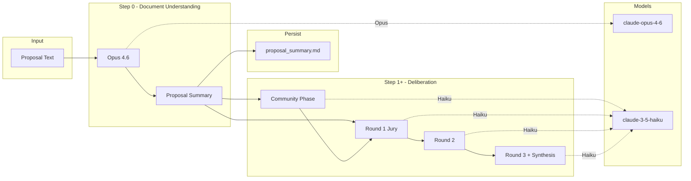

# HPIC AI-Augmented Deliberative Committee

Evaluate Chicago stadium and urban policy proposals using an AI panel of expert and community perspectives.

## Demo

The app lets you upload or select a proposal, choose a deliberation mode (jury-only or full with community), and run rounds step-by-step or all at once. Below is a short walkthrough.


## Architecture

The app uses a two-tier model design: Opus for document understanding, Haiku for deliberation.



## Quick start (Docker)

```bash
cp .env.example .env   # Add your ANTHROPIC_API_KEY
docker compose up
```

Open http://localhost:8501. Upload a proposal or choose one from the `proposals/` folder, select mode, and run deliberation.

## Local development (UV)

```bash
uv sync
cp .env.example .env   # Add your ANTHROPIC_API_KEY
uv run streamlit run app.py
```

CLI:

```bash
uv run python -m src.simulate --proposal proposals/draft.md [--mode jury|jury_quick|full] [--output-dir dir]
```

## Committee architecture and deliberation process

**Modes**

- **Jury only (4 experts — quick):** Four curated panelists (fiscal, political, community/equity, urban economics). Fastest option.
- **Jury only (7 experts):** Full expert panel from `agents/jury/`.
- **Full (community + jury):** Community stakeholders react first; their summary is then given to the jury.

**Rounds**

1. **Round 1 — Individual scoring**  
   Each jury member scores the proposal on Impact, Fiscal Responsibility, and Sustainability (1–10) with a short justification. Optionally informed by a community reactions summary (full mode).

2. **Round 2 — Deliberation**  
   Each panelist sees Round 1 scores and justifications and responds in character: agreement, disagreement, pushback, or emphasis.

3. **Round 3 — Final vote**  
   Each panelist gives final scores and a two-sentence verdict. A final **synthesis** call produces a short consensus report (strengths, weaknesses, conditions for recommendation).

In the app you can run **one round at a time** (see results after each) or **Run all rounds** in one go. Outputs (scores, deliberation log, report) are written to `outputs/<run_id>/`.

## Why this approach works

Research shows that when AI personas are built correctly—as **digital doubles** grounded in census data and neighborhood profiles—they can give voice to populations usually absent from policy debates. A Pilsen renter, an Austin business owner, a Bronzeville homeowner: each is modeled from real demographic and lived-experience data, not generic stereotypes.

Drawing on James Evans' work on [**societies of thought**](https://arxiv.org/html/2601.10825v1), when these agents deliberate—when they push back, agree, and disagree—the process generates **emergent perspectives and personalities** that enrich the debate. It is not just fixed voices; it is a dynamic exchange that surfaces tensions and tradeoffs that a single analyst would miss.

**Proposal length**

The app loads the full proposal (PDF or .md) up to 500,000 characters. **Step 0 (Opus)** receives the first 200,000 characters and produces a detailed summary, which is saved to `proposal_summary.md`. All deliberation (community, jury rounds, synthesis) uses this summary with Haiku. This two-tier design reduces cost and keeps deliberation fast.

## Environment

- `ANTHROPIC_API_KEY` — from [Anthropic Console](https://console.anthropic.com/). Required.
- `SUMMARIZER_MODEL` (optional) — default `claude-opus-4-6`. Used for document understanding.
- `DELIBERATION_MODEL` (optional) — default `claude-haiku-4-5`. Used for community, jury, and synthesis. For deeper reasoning you can set `claude-sonnet-4-5` (higher cost per run).

Never commit `.env`. Secrets are never sent to the browser or shown in the UI.

**Checking errors when something fails**

- **Docker:** `docker compose logs app` (or `docker compose logs -f app` to follow). API errors are logged to stderr.
- **Per-run log file:** After each run, the app writes `outputs/<run_id>/run.log` with API and run errors (e.g. 404, 401). With Docker, `outputs/` is bind-mounted, so check `./outputs/` on your host and open the latest run folder's `run.log`.

## Security

- API key is loaded only server-side; not in logs or error messages.
- Proposal uploads: only `.md` and `.pdf`, max 20 MB; saved to temp paths.
- Outputs are written only to `outputs/<run_id>/`.

## Adding or editing personas

Edit or add `.md` files under `agents/jury/` and `agents/community/`. Use the existing files as templates (Role, Background, Evaluation lens, Personality, Key questions or Key concerns).

## Community Stakeholder Methodology

**Overview**

The 8 community stakeholder profiles represent "digital doubles" — realistic Chicago residents grounded in demographic data and ethnographic detail. These profiles enable the deliberation system to consider how stadium and urban development proposals affect diverse communities across the city.

**Sampling Framework: Geographic Stratification**

Profiles are distributed across 4 geographic zones with 2 representatives each:

- **South Side:** Bronzeville homeowner (retired public sector, legacy concerns) + Greater Grand Crossing renter (working-class healthcare, displacement risk)
- **West Side:** Pilsen renter (low-income service worker, limited English) + Austin business owner (small business, community investment)
- **North Side:** Rogers Park renter (middle-income teacher, family affordability) + Lincoln Park homeowner (upper-middle professional, amenity-focused)
- **Loop-adjacent/Near South:** South Loop renter (high-income tech, pro-development) + Near West homeowner (middle-income nurse, pragmatic)

This design captures place-based differences in housing markets, transit access, development pressure, and community concerns.

**Data Sources**

Primary data from **ACS 2022 5-year estimates:**
- Income: Table B19013 (median household income by occupation/geography)
- Housing: Tables B25003 (tenure), B25064 (rent), B25077 (home values)
- Commute: Tables B08303 (travel time), B08301 (transportation mode)
- Education: Table B15003 (educational attainment)
- Occupation: Table C24010 (occupation by sex)
- Household: Table B11001 (household composition)
- Language: Table B16004 (language and English proficiency)

**Ethnographic authenticity** from real Chicago places (street names, CTA routes, schools, businesses) to reflect lived experience.

**Profile Structure**

Each profile includes:
1. **Personal Profile** — Age, household composition, years in neighborhood, language
2. **Location & Housing** — Specific neighborhood, housing type, tenure, costs
3. **Economic Profile** — Occupation, income, education, commute details
4. **Community Context** — Neighborhood ties, institutions, daily patterns
5. **Stakeholder Perspective** — Development concerns, priorities, and outlook
6. **Methodology notes** — ACS table references for key data points

**Design Choices and Limitations**

- **No explicit race/ethnicity coding:** Demographic characteristics are inferred through neighborhood, occupation, income, language, and community ties rather than explicit racial categories.
- **Representative types, not individuals:** Profiles represent demographic segments, not specific real people.
- **Ethnographic details are illustrative:** Specific businesses, streets, and institutions are plausible for each profile but not statistically sampled.
- **Focused on Chicago proper:** Profiles do not represent suburban Cook County.

**Using Profiles in Deliberation**

These stakeholders provide the community reaction phase (in "Full" mode) and inform jury deliberations. Their responses reflect how development proposals affect different economic positions, housing situations, and neighborhood contexts across Chicago.

**References**
- U.S. Census Bureau, American Community Survey 2022 5-year estimates: [data.census.gov](https://data.census.gov)
- Chicago Community Area profiles: [City of Chicago Data Portal](https://data.cityofchicago.org)
- CTA route and schedule information: [transitchicago.com](https://www.transitchicago.com)

## Lint and test

Install dev dependencies first: `uv sync --extra dev`

```bash
uv run ruff check .
uv run ruff format .
uv run pytest tests/ -v
```

To verify the API key and a simple prompt work (optional integration test):

```bash
uv run pytest tests/test_agents.py -m integration -v
```

Skipped if `ANTHROPIC_API_KEY` is unset or invalid.
