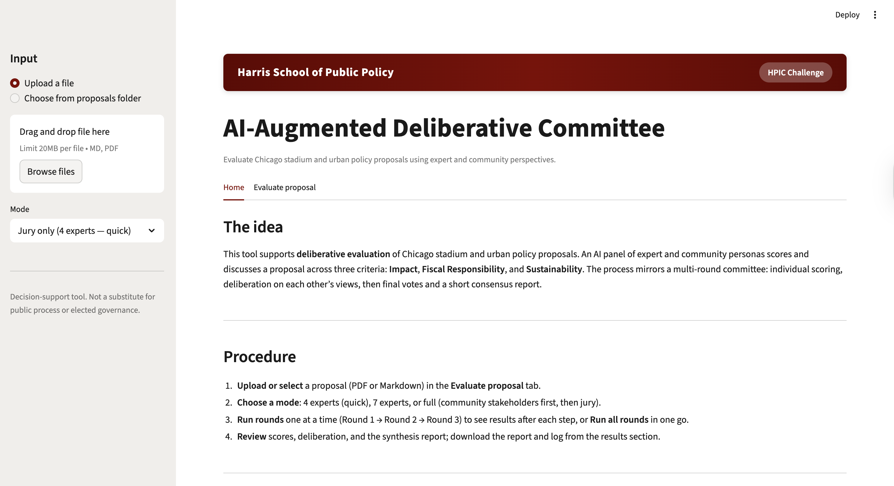

# Annex: AI-Augmented Deliberative Committee — Approach and Implementation

*Harris School of Public Policy · HPIC Challenge*

This annex summarizes the approach and implementation of an AI-based deliberative committee used to evaluate Chicago stadium and urban policy proposals. The tool supports structured, multi-round evaluation by an AI panel of expert and community personas aligned with the City’s stated criteria.

---

## 1. Approach

**Objective.** Provide decision support for evaluating proposals (e.g., stadium and related urban policy) through a simulated committee that (1) scores proposals on Impact, Fiscal Responsibility, and Sustainability, (2) deliberates on those scores in character, and (3) produces final verdicts and a short consensus report.

**Design choices.**

- **Persona-based panel:** Each “member” is defined by a markdown persona (role, background, evaluation lens, personality). The same criteria and prompt structure are used for all jury members so that outputs are comparable and parseable.
- **Multi-round flow:** Individual scoring (Round 1) → deliberation on each other’s views (Round 2) → final scores and verdicts plus synthesis (Round 3). This mirrors a real committee and surfaces agreement and dissent.
- **Optional community input:** In “full” mode, community stakeholders react to the proposal first; a summary of their reactions is then given to the jury in Round 1.
- **Step-through or run-all:** Users can run one round at a time and review results before continuing, or run all rounds in a single batch.

---

## 2. Committee Architecture

**Modes.**

| Mode | Description |
|------|-------------|
| Jury only (4 experts — quick) | Four curated panelists (fiscal, political, community/equity, urban economics). Fewer API calls; suitable for quick runs. |
| Jury only (7 experts) | Full expert panel; all jury personas from the repository. |
| Full (community + jury) | Community stakeholders react first; their summary is passed to the jury for Round 1. |

**Personas.** Stored as markdown files under `agents/jury/` and `agents/community/`. Each file defines role, background, evaluation lens, personality, and (for jury) key questions or (for community) key concerns. The system prompt for each API call is built from this content plus fixed criteria text.

**Criteria.** All jury scoring uses three dimensions (1–10 scale with justification):

- **Impact** — Benefit to a cross-section of Chicagoans, accessibility, affordability, local engagement, youth, partnerships.
- **Fiscal Responsibility** — New tax revenues, job creation, justification of subsidies/debt, accountability, long-term fiscal sustainability.
- **Sustainability** — Design sustainability and adaptability, mix of uses beyond sports, environmental practices, evolution with trends.

---

## 3. Deliberation Process

1. **Round 1 — Individual scoring**  
   Each jury member receives the proposal (and, in full mode, the community summary) and returns scores for Impact, Fiscal Responsibility, and Sustainability plus a short justification. Outputs are parsed for structured scores and stored for Round 2.

2. **Round 2 — Deliberation**  
   Each panelist is shown Round 1 scores and justifications (and optionally prior Round 2 responses) and responds in character: agreement, disagreement, pushback, or emphasis. Responses are appended to the deliberation log.

3. **Round 3 — Final vote**  
   Each panelist sees the deliberation so far and submits final scores and a two-sentence verdict. A separate **synthesis** call then produces a short consensus report (strengths, weaknesses, conditions for recommendation, and dissenting views where relevant).

Outputs (round-by-round scores, deliberation log, synthesis report) are written under `outputs/<run_id>/` and can be viewed and downloaded in the app.

---

## 4. Implementation

**Stack.**

- **Language and runtime:** Python 3.11+ (UV for dependency and environment management).
- **LLM:** Anthropic Messages API (Claude). One API call per agent turn; no persistent session; full context (proposal excerpt, prior round content) is sent in each request.
- **UI:** Streamlit (single-page app with Home and Evaluate proposal tabs). Styling uses University of Chicago Harris School brand colors (maroon, grays).
- **Deployment:** Docker for local or server runs; Streamlit Community Cloud for public deployment (app and API key configured via Secrets).

**Flow.**

1. User uploads a proposal (PDF or Markdown) or selects one from a folder. Text is cleaned (normalized line endings, control characters removed) and truncated to a maximum length (e.g. 500,000 characters) for loading.
2. For each round, the orchestration layer builds prompts (with proposal excerpts capped at 120,000 characters for the jury and 60,000 for the community phase), calls the API once per panelist with a short delay between calls to reduce rate limits, and parses or stores responses.
3. Round 1 and Round 2 outputs are written incrementally; Round 3 adds final scores, verdicts, and the synthesis report. The app displays results by round and offers download of the report and full deliberation log.

**Security and robustness.**

- API key is read from the environment (or Streamlit Secrets) and never logged or sent to the client.
- Proposal uploads are restricted to `.md` and `.pdf` with a maximum file size (e.g. 20 MB). Paths are validated to prevent traversal.
- Outputs are written only under a dedicated run directory. Optional app-level password (stored in secrets) can gate access to the evaluation workflow on the deployed app.

---

## 5. Screenshots of the Application

*Caption (example):* Home tab of the AI-Augmented Deliberative Committee app showing the idea, procedure, and rounds. Harris School of Public Policy branding and HPIC Challenge badge in the header.

User can run rounds step-by-step or run all and download the report and deliberation log.

---

*End of annex.*
